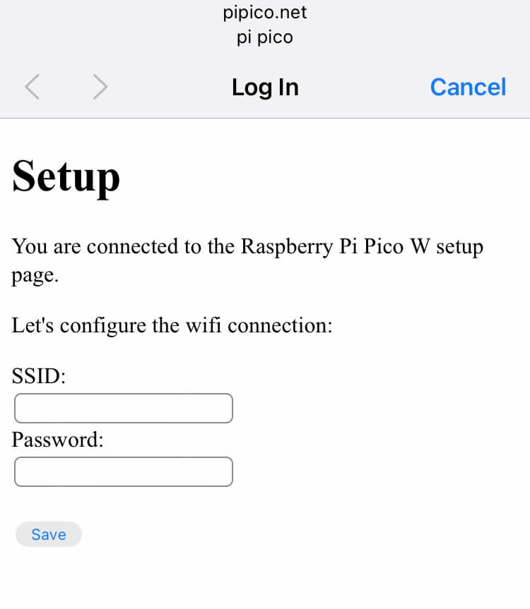
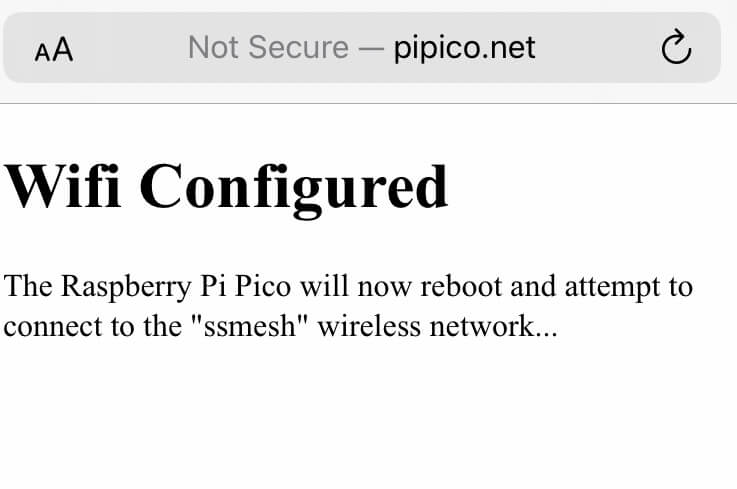
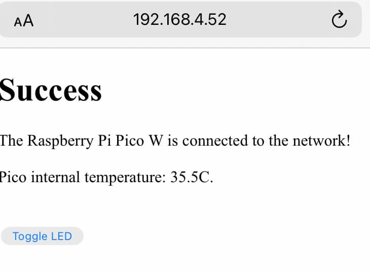

# Wireless Networking Setup Example for Raspberry Pi Pico W

This repository contains a demo [MicroPython](https://micropython.org/) application that can be used as a start point for any project where you want the user to be able to easily configure wifi connection on a [Raspberry Pi Pico W](https://www.raspberrypi.com/products/raspberry-pi-pico/).  The demo makes use of Pimoroni's [Phew!](https://github.com/pimoroni/phew) webserver and templating library - a copy of this is contained in this repository in the `phew` folder.

The demo works by first exposing a captive wifi access point.  The user uses a device such as their phone, tablet or laptop to connect to that access point, and is presented with a web page asking them to input their wifi network SSID and password.

[Watch a full walk through of this project on YouTube here](https://www.youtube.com/watch?v=Gzp9nLkqadg&t=22s).  (This video was made before the temperature display was added to the front end).

These credentials are saved as a file on the Pi Pico W which then reboots and attempts to connect to the network.  If a connection to the network is made, the device runs your application.  If the supplied wifi credentials were incorrect, it retries the connection a few times (sometimes connecting from "cold" can be slow) then goes back into access point mode and the user can try to enter updated credentials.

In this demonstration, the application that the device runs presents a simple web front end with a button on it that the user can use to toggle the Pi Pico W's onboard LED.  It also display's the Pico's internal temperature using the (not very accurate) sort of temperature sensor ([read about this here](https://www.coderdojotc.org/micropython/advanced-labs/03-internal-temperature/)).

The user accesses the front end by browsing to the device's IP address.  When the device successfully connects to the network, it logs the IP address to the console using a `print` statement.  Ideally it should show this on a connected display so that the user knows which IP address to use in order to connect to the application's front end.  If your application doesn't rely on a web front end, then this bit of information doesn't necessarily need to be communicated to the user. 

I created this demo after reading Kevin McAleer's article about how to set up an access point with Phew! ([read on Kev's website](https://www.kevsrobots.com/blog/phew-access-point.html)).

This has been tested using Pimoroni's 1.20.4 MicroPython build ([available here](https://github.com/pimoroni/pimoroni-pico/releases/tag/v1.20.4)) but it should work on any 1.20 build of MicroPython as it doesn't use Pimoroni specific libraries.

## Shopping List

To follow along, you'll need some things that cost money, and others that you may already have or which are free:

* A laptop or desktop computer (could be a Mac, Windows or even a regular Raspberry Pi) to run a code editor on and install files to the Pi Pico W from.
* A [Raspberry Pi Pico W](https://shop.pimoroni.com/products/raspberry-pi-pico-w?variant=40059369619539) (it must be the W version, other versions don't have wifi!)
* A cable to connect the Raspberry Pi Pico W to your development machine.  It will need a micro USB connection at the Pico end, and either a USB A or C at the other end.  For example [something like this](https://shop.pimoroni.com/products/usb-a-to-microb-cable-black?variant=31241639498).  Make sure your cable provides both data and charging.  A charge only cable won't work when it comes to copying files to the Pi Pico W.
* A copy of the MicroPython runtime for the Pi Pico W.  You can download the latest .uf2 file [here](https://micropython.org/download/rp2-pico-w/rp2-pico-w-latest.uf2).  Just save it somewhere on your machine for now.  As I knew I'd want to add some sensors etc that Pimoroni provides drivers for, I used their MicroPython build [here](https://github.com/pimoroni/pimoroni-pico/releases/tag/v1.20.4).
* A code editor that can connect to the Pi Pico W and copy files to it.  I use [VS Code](https://code.visualstudio.com/) with the [Pico W Go extension](https://marketplace.visualstudio.com/items?itemName=paulober.pico-w-go), you could also use [Thonny](https://thonny.org/).

## Raspberry Pi Pico W Setup

### Install MicroPython

Connect the Raspberry Pi Pico W to your machine using the USB cable.  This powers the Pi Pico W and also provides a data connection to it.  Follow the drag and drop instructions [here](https://www.raspberrypi.com/documentation/microcontrollers/micropython.html#drag-and-drop-micropython) to install MicroPython.

### Code Editor Setup

I use VS Code as my editor.  If you choose to use Thonny, configure it to work with the Pi Pico W by following the instruction in section 4.1, Using Thonny [here](https://datasheets.raspberrypi.com/pico/raspberry-pi-pico-python-sdk.pdf).

If you're using VS Code install the [Pico-W-Go extension](https://marketplace.visualstudio.com/items?itemName=paulober.pico-w-go) from the marketplace ([how to browse and install extensions](https://code.visualstudio.com/docs/editor/extension-marketplace)).

Whichever editor you're using, you'll next want to clone this repository from GitHub and open it in your editor.  Here's how to do this with VS Code from the terminal on a Mac:

```bash
git clone https://github.com/simonprickett/phewap.git
cd phewap
code .
```


## Install and Run the Software on the Raspberry Pi Pico W

I'm using VS Code for this.  Whichever editor you use, you'll need to have first installed the MicroPython runtime on the Raspberry Pi Pico W (see earlier instructions).

With the folder that you cloned this repository into open in VS Code, plug the micro USB end of your cable into the Raspberry Pi Pico W and the USB A or C end of your cable into the machine that's running VS Code.

Connect to the Pi Pico W from VS Code by clicking the "Pico W Disconnected" button in the editor's footer bar.  Wait for this to change to "Pico W Connected".

Now, copy the project files to the Pi Pico W.  Click on "All Commands" in the editor's footer bar, and select "Pico-W-Go > Upload project".  This copies all of the project files to the device and resets it.  It will then start running the project.

To see the logs in VS Code's built in Terminal, click the "Pico W Disconnected" button to reconnect.

## Connect to the Access Point and Configure the Wifi

When the software first runs, it exposes a wifi access point for the user to connect to.  The access point is called "pi pico" (you can change this in the code if you like) and it doesn't require a password.  

Using a wifi capable device (your phone, tablet, another computer etc), connect to the "pi pico" wifi network.  

Your device may automatically pop up a web page served to it by the Pi Pico W.  Use the form on this page to provide your wifi network's SSID and password then click "Save".

If you don't automatically see the web page, open your device's browser and navigate to `http://pipico.net`

Here's what the page looks like on an iPhone:



Once you hit "Save", the Pi Pico W will reset and attempt to connect to your wifi (here it's attempting to connect to an SSID named "ssmesh"):



If it succeeds, it will log its IP address to the console (connect to the Pi Pico W from VS Code to see this).  Using any other device that's connected to the same wifi network, browse to `http://<device ip address>` to see the application home page:



Use the "Toggle LED" button to toggle the onboard LED on the Pi Pico W board.  The application code now also has access to the internet via your wifi network.  The internal temperature displayed updates automatically every few seconds.

If you made a mistake when providing your wifi credentials, the Pi Pico W will try and connect then swap back to exposing the "pi pico" access point so that you can try again.

## Code Walkthrough

Here's a high level run through of how the code works.

When the Pi Pico W starts up, it starts the MicroPython runtime which then runs the code in `main.py`.  The first thing that happens is that we check for the presence of the wifi configuration file using `os.stat`.

If thie file is found, it is assumed to be a JSON file containing keys `ssid` and `password`.  The following actions are then taken:

*  The file is read, and these values are used to attemmpt to connect to the wifi network.
* If the connection is successful, the device's new IP address is printed to the console and the logic in the function named `application_mode` is run.  If you are making a device with an attached display, you should show this on the display so that the user can connect to it if your application uses a web display.
* If the device fails to connect, for example because the wifi isn't reachable or the user provided incorrect credentials, then the wifi configuration file is deleted and the device reboots.  This will put it in access point mode to allow the user to try and configure the wifi again.  I added a retry loop to try the connection up to three times as I noticed sometimes it times out on a first attempt (maybe time to start the hardware and scan for the SSID).

If the wifi configuration file isn't found, the device is either being started for the first time, or a previous attempt to configure the wifi failed.  In this case, the following happens:

* The logic in the function named `setup_mode` is run.
* A Phew! web server is configured with the routes we need to prompt the user for thr wifi details and capture them, plus a catch all route to redirect web requests to the configuration screen.
* We put the Pi Pico W into captive access point wifi mode, using the value of `AP_NAME` as the SSID for the user to connect to.  This is part of the Phew! framework ([read about it here](https://github.com/pimoroni/phew#access_point))
* A fake DNS server is run to resolve all DNS requests.  This is part of the Phew! framework ([read about it here](https://github.com/pimoroni/phew#dns-module)).
* The code in the function `ap_index` ensures that the contents of `ap_templates/index.html` are served whenever a browser asks for the root page. This contains a form whose submit acion goes to `/configure` and triggers the code in the `ap_configure` function.  This function saves the values submitted from the form into a file called `wifi.json`, tells the user that the credentials have been saved and reboots the device.  The device is rebooted in a background thread a second later, allowing time for the page template to be rendered and returned to the user.

## Adapt this for your own Application

This is intended as a basic demo of how to get a Pi Pico W up and running on a wifi network, so that you can ship products on them to people who can then connect them to their networks without any coding skills required.

To use this as the basis of your own application, you'll want to:

* Change the templates in `ap_templates` to ask the user for any additional information that you require from them.  For example your application may use an API that requires an access key that the user has to provide.
* Change the templates in `app_templates` for ones that represent your application's web front end.  If your application doesn't have a web front end, you can remove these.
* Change the code in `main.py` so that it:
    * Makes use of any additional data items that you asked the user for.
    * Implements your application logic in the `application_mode` function, including any additional web listener routes.  The [Phew! documentation](https://github.com/pimoroni/phew) will be helpful here.
* Change the code for the `/temperature` route in `main.py` (function name is `app_get_temperature`).  Modify this to connect to a real sensor, rename it, make it do what you like!  Check out the embedded JavaScript in `app_templates/index.html` to see how the front end polls this route periodically.

What sort of thing could you build?  This probably depends on what you plan to attach to your Pi Pico W. for example, you might build a [Cheerlights](https://cheerlights.com/) display with an LED matrix, or a weather station with an e-ink screen and various environment sensors.

If you build anything using this, I'd love to see it!
